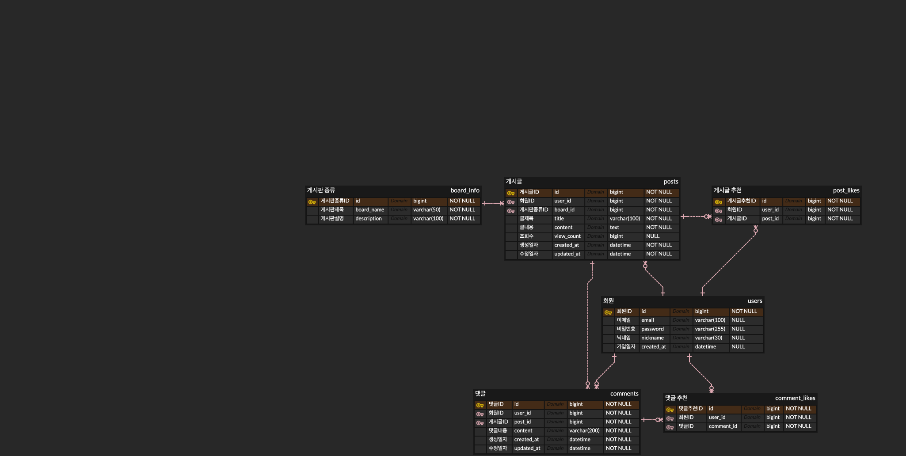

# 게시판 기능 성능 측정 기록
## ERD

## 성능 최적화 (N+1) 문제

### 1. 문제상황

게시글 목록 조회 API('GET /api/post-jpa')는 단순 Post(게시글) 엔티티 뿐만 아니라, User(사용자), Comment(댓글), PostLike(게시글 좋아요수) 정보를 함께 반환해야 했습니다.

하지만, JPA가 제공하는 기본 'findAll()' 메서드와 '.map()'을 이용한 초기 구현은 N+1 문제를 야기했습니다. 'p6spy'를 통해 확인한 결과, 10개의 게시글을 확인하기 위해 총 31번(1 + 10*3)의 쿼리가 실행되는 것을 확인했습니다.

### 2. N+1 현상

'p6spy'를 통해 확인한 결과, 게시글 목록 조회 API 요청 한번 당, 다음과 같이 한번의 메인 쿼리 수행 후 연관되어 있는 다른 엔티티를 반복해서 호출하는 것을 확인했습니다.

### 3. 문제 해결
